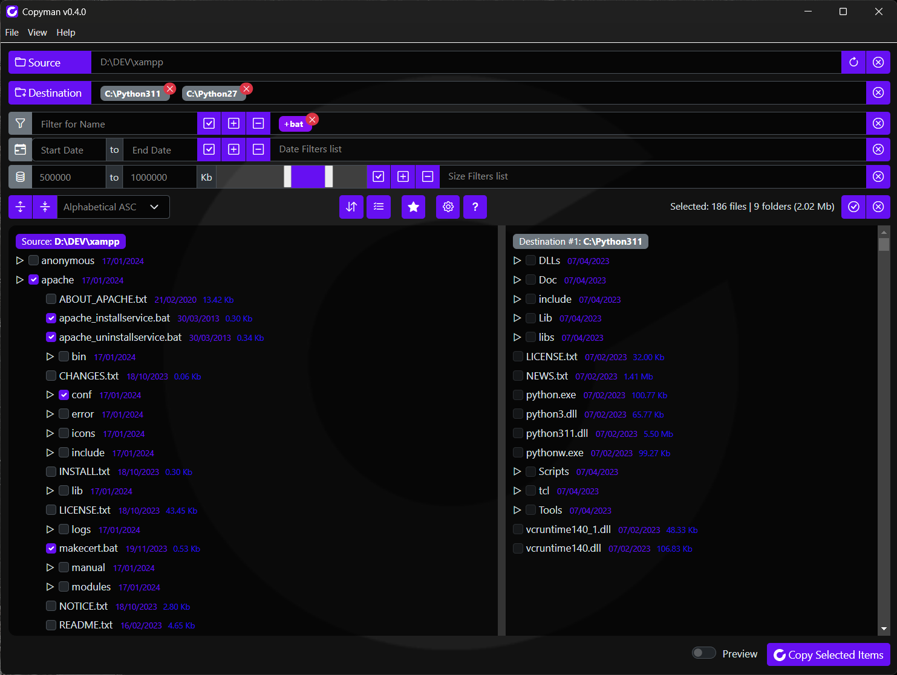

# Copyman

## File copying, reinvented

Copyman is the ultimate file copying utility designed to make your workflow faster and more efficient. With blazing-fast performance, it allows you to copy files simultaneously from a single source folder to multiple destination folders while preserving the folder structure and automating repetitive tasks.

### Key Features:

- **Fast and Smart** – Copy large files and folders at high speed.
- **Advanced Selection** – Quickly select files and folders using powerful filters or an intuitive tree structure.
- **Snapshots for Automation** – Save complex operations (folders, filters, options, selections) as snapshots and execute them with a single click—individually or in batches.
- **Flexible Copy Modes** – Customize behavior: choose to overwrite existing files, sync folder structures, or keep only selected files...
- **Free and Cross-Platform** – Enjoy Copyman on your preferred operating system, completely free.

Take control of your file management with Copyman—effortless, fast, and reliable.



## Development

### Requirements

- **Node.js**: Make sure you have Node.js installed (version 21 or higher is recommended).
- **Electron**: Version 34 is used to create the desktop application.

### Installation

```bash
npm install
```

### Running the Application

Launch the Electron application in development mode by executing:

```bash
npm start
```

or, to activate Developer Tools:
```bash
npm run dev
```
that adds `--inDebug` argument to electron launch script.

### Build the Application

Build the application into an executable for each platform:

```bash
npm build:win
```
```bash
npm build:mac
```
```bash
npm build:linux
```

### Binaries Download
You can download already compiled executables from:

https://www.copyman.it

## Usage

For instructions on usage, please refer to [docs/USAGE.md](docs/USAGE.md).

## To Do

For more details on planned to-do list, please refer to [TODO.md](TODO.md).

